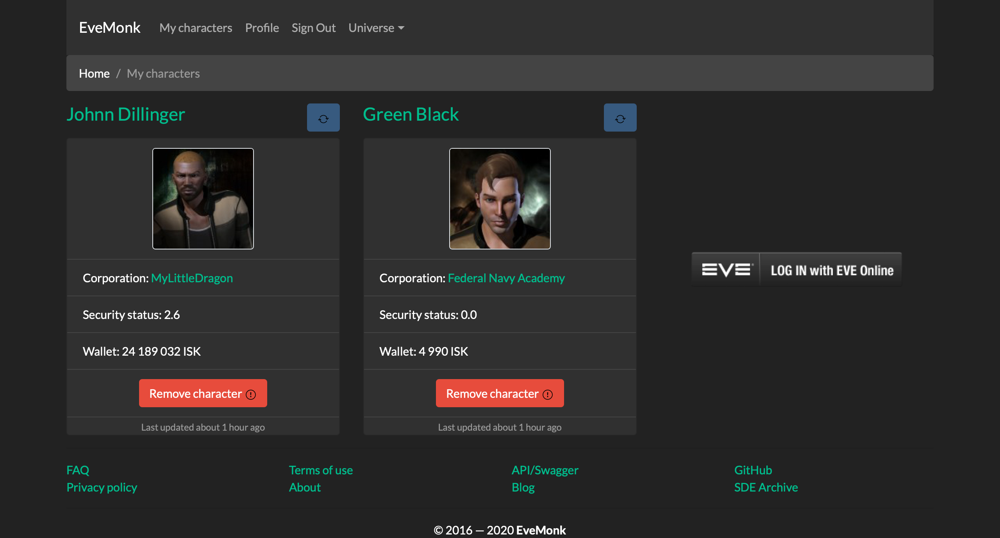
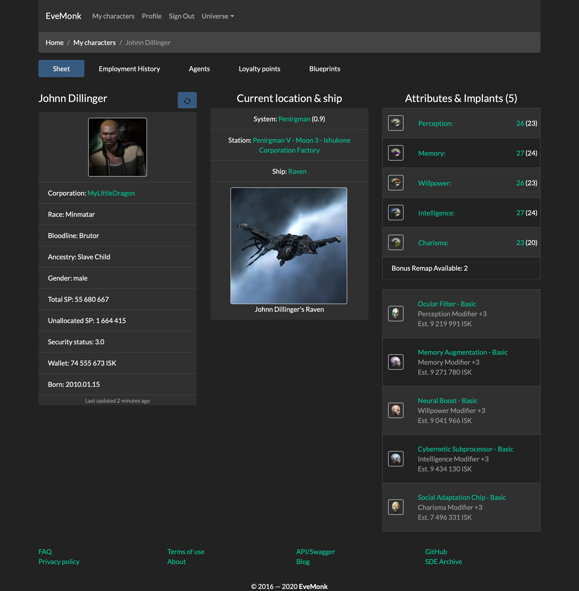
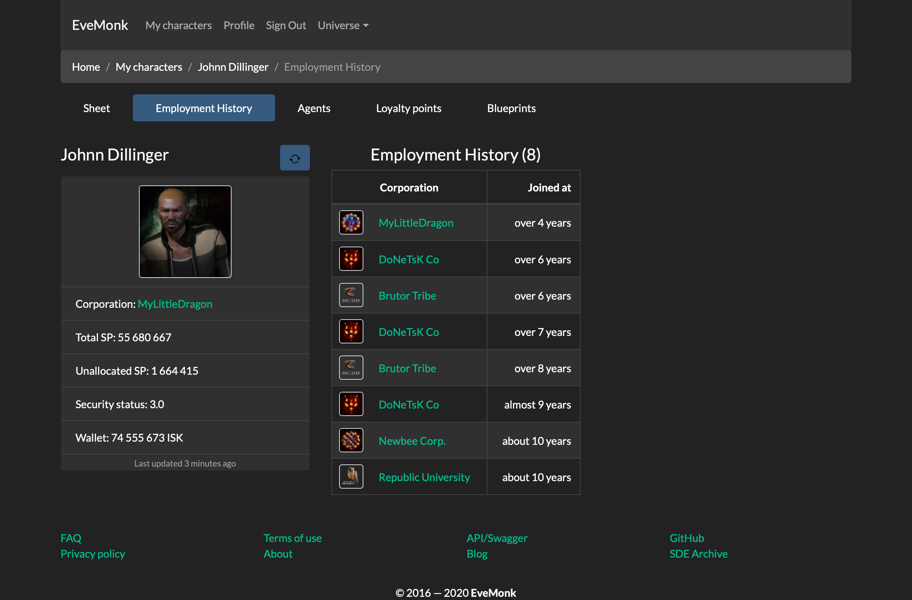
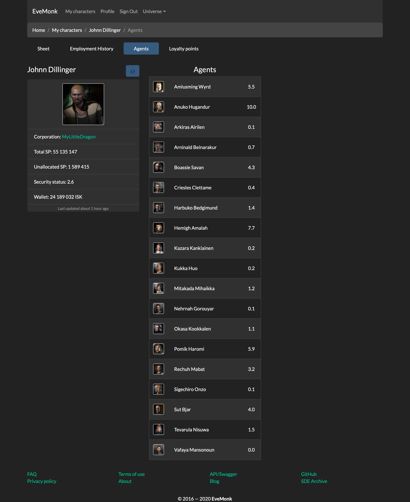
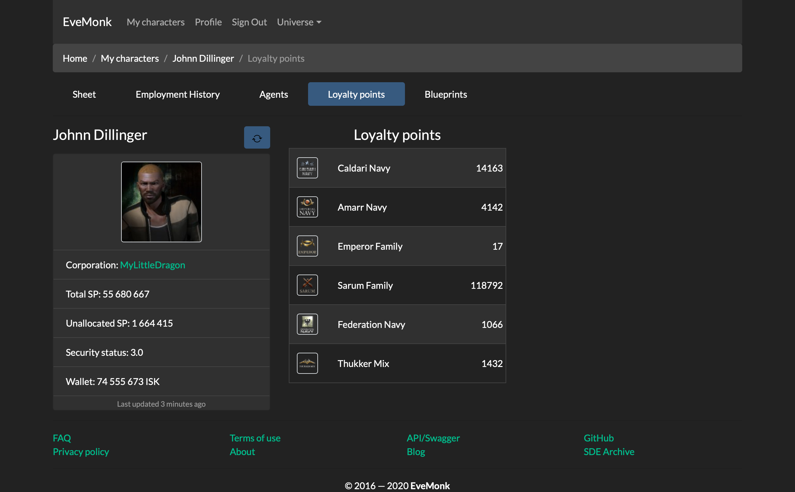

# EveMonk is an EVE Online management suite

EveMonk is an EVE Online management suite

Styled with Twitter Bootstrap. And Bootswatch Darkly theme.

Mobile first design.

## Features

- Alliances list
- Corporations list
- Characters list
- Alliance show
- Corporation show
- Character show
- Open Graph tags
- SEO friendly
- Authentication
- User characters info

## Screenshots

All screenshots are real and made in Safari on latest macOS Catalina (10.15.3).

## Stack

- [rbenv](https://github.com/rbenv/rbenv)
- [ruby-build](https://github.com/rbenv/ruby-build)
- [Ruby](http://www.ruby-lang.org)
- [Ruby on Rails](https://rubyonrails.org)
- [Turbo](https://turbo.hotwired.dev)
- [Stimulus](https://stimulus.hotwired.dev)
- [PostgreSQL](https://www.postgresql.org)
- [Redis](https://redis.io)
- Minio (S3 compatible storage)
- Bootstrap 4.6.1
- [Bootstrap Icons](https://icons.getbootstrap.com)
- Bootswatch Darkly 4.6.1

## Configure

TODO

## Links

- [The official repository for ESI documentation](https://github.com/esi/esi-docs)
- [EVE Swagger Interface](https://esi.evetech.net/ui/)
- [One place to hold all EVE logic recreated in ESI](https://github.com/esi/eve-glue)
- [Eve Online Static Data Export (SDE) and Image Export Collection (IEC) downloader](https://github.com/evemonk/eveonline-sde-iec-downloader)

## Guides

- [Ruby coding style guide](https://github.com/bbatsov/ruby-style-guide)
- [Ruby on Rails style guide](https://github.com/bbatsov/rails-style-guide)
- [Active Job Style Guide](https://github.com/toptal/active-job-style-guide)
- [Security Guide for Developers](https://github.com/FallibleInc/security-guide-for-developers)
- [Zen Rails Security Checklist](https://github.com/brunofacca/zen-rails-security-checklist)
- [Rails SQL Injection](http://rails-sqli.org)
- [Timeouts for popular Ruby gems](https://github.com/ankane/the-ultimate-guide-to-ruby-timeouts)
- [HTTP access control (CORS)](https://developer.mozilla.org/en-US/docs/Web/HTTP/Access_control_CORS)
- [The Twelve-Factor App](https://12factor.net/)
- [HTTP Status Codes](https://httpstatuses.com)
- [Idiosyncratic Ruby](https://github.com/janlelis/idiosyncratic-ruby.com)
- [Fundamental programming with ruby examples](https://github.com/khusnetdinov/ruby.fundamental)
- [Rails Directory Structure Guide](https://github.com/jwipeout/rails-directory-structure-guide)
- [A free guide to HTML5 <head> elements](https://htmlhead.dev)
- [Content Security Policy](https://developers.google.com/web/fundamentals/security/csp)
- [CSP Evaluator](https://csp-evaluator.withgoogle.com/?csp=https://evemonk.com/)
- [Security Headers](https://securityheaders.com/?q=https%3A%2F%2Fevemonk.com%2F&followRedirects=on)
- [Content Security Policy - An Introduction](https://scotthelme.co.uk/content-security-policy-an-introduction/)
- [CLI interface for HEAD snippets](https://github.com/hemanth/head-it)
- [EStimator](https://estimator.dev/)

## Author

- Igor Zubkov (@biow0lf)

## License

EveMonk is available as open source under the terms of the [MIT License](http://opensource.org/licenses/MIT).
